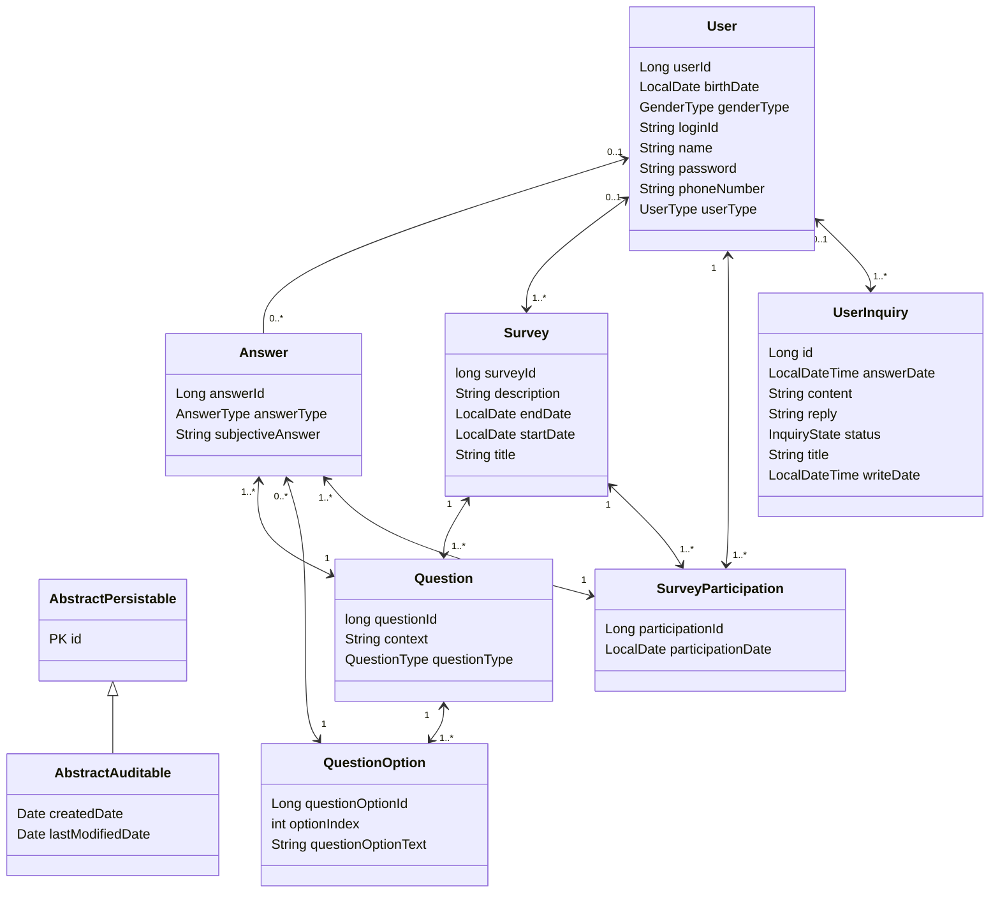

# Client 요청에 따른 WebServer 동작

<aside>
💡 **Based On Kotlin And SpringBoot**

</aside>


# 내부 동작 개념 설명

## 1. Web Server

`SpringBoot`의 `웹 서버`는 `웹 컨테이너`를 가지고

이를 `Servlet Container`라고도 부르며, 대표적으로 `Tomcat`이 있다.


                 User                                                                                                                Server

`Tomcat`은 `SpringBootApplication`이 실행되면 시작되며 모든 `HTTP 요청`을 받아들인다.

## 2. Dispacher Servlet


요청이 들어오면 Spring의 중심부인 `DispatcherServlet`이 이 요청을 처리하게 된다.

`DispatcherServlet`은 Spring MVC 의 핵심 컴포넌트로, 

들어오는 요청을 적절한 `Controller`로 라우팅하는 역할을 한다.

## 3. Controller


`Spring MVC`에서 `Controller`는 클라이언트 요청을 처리하는 메소드를 포함하는 클래스이다.

`@RestController` 또는 `@Controller` 어노테이션으로 정의된다.

## 4. Service Layer

복잡한 애플리케이션에서는 `Controller`가 직접 `비즈니스 로직`을 처리하지 않고, 

**서비스 계층**에 처리를 위임한다.

이 계층은 `Controller` 와 `Repository` 사이에서 `비즈니스 로직`을 담당한다.

## 5. Http Response - Request


### 서버→ 클라이언트

컨트롤러 메소드가 요청을 처리하고 결과를 생성하면

이 결과는 `ResponseEntity` 또는 `직접적인 반환값`으로 클라이언트에게 전달

[Web에서 본 ResponseEntity 형식] → .json


### 클라이언트 → 서버

특정 엔드포인트에 대한 응답의 예

```makefile
HTTP/1.1 200 OK  # 상태코드 200은 요청이 잘 완수되었다는 의미
Content-Type: application/json
Content-Length: 17

"Accepted"
```

## 6.  데이터베이스 연동

요청된 데이터를 데이터베이스에 영구적으로 저장시켜 `CRUD transaction`이 가능하도록 만든다.

**`Repository`** 를 통해 JPA 나 JDBC 등을 사용하여 데이터베이스와 상호 작용 하게 한다.

e.g.

```kotlin
@Entity
data class User(
    @Id @GeneratedValue(strategy = GenerationType.IDENTITY)
    val id: Long,
    val name: String
)

interface UserRepository : JpaRepository<User, Long>

@Service
class UserService(private val userRepository: UserRepository) {
    fun getUserGreeting(userId: Long): String {
        val user = userRepository.findById(userId).orElseThrow { RuntimeException("User not found") }
        return "Hello, ${user.name}!"
    }
}

@RestController
@RequestMapping("/api")
class GreetingController(private val userService: UserService) {

    @GetMapping("/user-greeting")
    fun userGreeting(@RequestParam userId: Long): ResponseEntity<String> {
        val message = userService.getUserGreeting(userId)
        return ResponseEntity.ok(message)
    }
}

```

- UserRepository 는 JpaRepository를 상속받아 Repository 역할을 함.
- 클라이언트가 `/user-greeting` 경로에 `userId`를 포함한 GET 요청을 보내면 `Controller`가 동작
- `Controller`가 동작하면 `Service`에서 `비지니스 로직`이 동작
- `비지니스 로직`이 동작하는 중간에 `Repository`에서 `Spring Data JPA`를 통해 자동으로 `데이터베이스 접근`을 처리

# WebServer Module 간 매핑 표

## Controller Module 기준 Mapping

### Admin Package

| Controller | ControllerMethod | EndPoint | Service | ServiceMethod | Info |
| --- | --- | --- | --- | --- | --- |
| AdminInquiryController | adminInquiryList | /admin/inquiry | UserInquiryService | getInquiryList | 모든 문의 글 get |
|  | adminDetailInquiry | /admin/inquiry/{inquiryId} | userInquiryService | getInquiryById | 문의 글을 Id 기준으로 받아 옴 |
|  | replyInquiry | /admin/inquiry/{inquiryId} | userInquiryService | saveReplyInquiry | 문의 글에 대한 답변을 작성하여 repo에 저장 |
|  |  |  | userInquiryService | getInquiryById | 문의 글을 Id 기준으로 받아 옴 |
|  | editReply | /admin/inquiry/edit/{inquiryId} | userService | checkLogin | user Id 를 받아 로그인이 되어 있는지 세션 확인 |
|  |  |  | userInquiryService | saveReplyInquiry | 문의 글에 대한 답변을 작성하여 repo에 저장 |
|  |  |  | userInquiryService | getInquiryById | 문의 글을 Id 기준으로 받아 옴 |
| AdminMemberController | adminMemberList | /admin/member | userService | getUserList | UserList 를 받아 옴 |
|  | adminMemberDetail | /admin/member/{userId} | userService | findOne | 멤버 하나의 정보를 받아 옴 |
|  | adminMemberDelete | /admin/member/delete/{userId} | userService | checkLogin | user Id 를 받아 로그인이 되어 있는지 세션 확인 |
|  |  |  | userService | deleteUserByUserId | user Id 를 기준으로 유저를 repo 에서 삭제시킴 |
| AdminSurveyController | adminSurveyList | /admin/survey | surveyService | getSurveyList  | 모든 설문 목록을 받아 옴 |
|  |  |  | userService | checkLogin | user Id 를 받아 로그인이 되어 있는지 세션 확인 |
|  | adminDetailSurvey | /admin/survey/{surveyId} | userService | checkLogin | user Id 를 받아 로그인이 되어 있는지 세션 확인 |
|  |  |  | surveyService | getSurveyById | 설문 조사 정보를 Id 로 받아옴 |
|  |  |  | surveyParticipationRepository | getSurveyParticipationListBySurveyId | 설문조사 참여 정보를 참여 Id 기준으로 받아 옴 |
|  | adminSurveyDelete | /admin/survey/delete/{surveyId} | userService | checkLogin | user Id 를 받아 로그인이 되어 있는지 세션 확인 |
|  |  |  | surveyService | deleteSurvey | 설문 조사를 삭제함 |

### Global Package

| Controller | ControllerMethod | EndPoint | SpringFramework/ Service | Related Method | Info |
| --- | --- | --- | --- | --- | --- |
| ChatController | sendMessage | /chat.sendMessage |  |  |  |
|  | addUser | /chat.addUser | SimpMessagingTemplate | addUser | message 의 sender 를 현재 채팅에 참여한 사용자로 추가 |
|  |  |  | SimpMessagingTemplate | convertAndSend | message.sender 가 참여했다는 메시지 생성 후 “/topic/pulic” 경로로 해당 메시지 전송 |
|  | sendHttpMessage | /chat/sendMessage | SimpMessagingTemplate | convertAndSend | 경로로 해당 메시지 전송 |
|  | getOnlineUsers |  | SimpMessagingTemplate | convertAndSend | 경로로 해당 메시지 전송 |
| HomeController | home | /home |  |  |  |
|  | logout | /home.logout |  |  |  |
|  | getSessionUsername | /home/session-username |  |  |  |
|  | adminHome | /home/session-username |  |  |  |
| UserController | createForm | /user/new |  |  |  |
|  | createUser | /user/new | userService | validateDuplicateUserByLoginId | Repository 에 user 가 존재하는지 검증 |
|  |  |  | userService | join | user 가 Repository 에 존재하지 않을 시 회원 가입 |
|  | loginForm | / |  |  |  |
|  | login | / | userService | findUserByLoginId | 첫 화면 :: 로그인 폼을 넘겼을 때 해당 아이디의 유저가 있는지 확인 |

### User Package

| Controller | ControllerMethod | EndPoint | Service | ServiceMethod | Info |
| --- | --- | --- | --- | --- | --- |
| UserInquiryController | listInquiry | /home/inquiry | userService | checkLogin | login 여부 확인 |
|  |  |  | userInquiryService | getInquiryList | 문의 글 목록을 가져옴 |
|  | createInquiryForm | /home/inquiry/post | userService | checkLogin | login 여부 확인 |
|  | writeInquiry | /home/inquiry/post | userService | checkLogin | login 여부 확인 |
|  |  |  | userInquiryService | createInquiry | 질의를 객체로 생성 |
|  |  |  | userInquiryService | saveInquiry | 생성된 질의를Repository 에 질의 저장 |
|  | detailInquiry | /home/inquiry/{inquiryId} | userService | checkLogin | login 여부 확인 |
|  |  |  | userInquiryService | getInquiryById | Inquiry Id 에 해당하는 문의 글을 get → 상세 보기 |
| UserProfileController | viewUserProfile | /user/profile | userService | checkLogin | login 여부 확인 |
|  |  |  | userService | findUserByLoginId | profile 에 해당하는 유저를 찾는다 |
|  |  |  | surveyService | getUserSurveyList | profile 에 해당하는 유저의 surveylist 조회 |
|  |  |  | surveyParticipationService | getUserParticipatedSurveyList | profile 에 해당하는 유저가 참여한 설문 목록 반환 |
|  | createUserForm | /user/profile/edit | userService | checkLogin | login 여부 확인 |
|  |  |  | userService | findUserByLoginId | profile 에 해당하는 유저를 찾는다 |
|  | editUserInformation | /user/profile/edit | userService | findUserByLoginId | profile 에 해당하는 유저를 찾는다 |
|  |  |  | userRepository | findByPhoneNumber | 전화번호에 해당하는 유저를 찾음 |
|  |  |  | userService | validateDuplicateUserByPhoneNum | Duplicate 를 방지하기 위함 |
|  |  |  | userService | updateUser | 수정된 회원 정보 갱신 |
|  | deleteCreatedSurvey | /user/survey/delete/{surveyId} | userService | checkLogin | login 여부 확인 |
|  |  |  | surveyService | getSurveyById | survey Id 에 해당하는 설문을 가지고 옴 |
|  |  |  | surveyService | deleteSurvey | 가지고 온 설문을 repo 에서 지움 |
|  | viewCreatedSurvey | /user/survey/view/{surveyId} | userService | checkLogin | login 여부 확인 |
|  |  |  | surveyService | getSurveyById | survey Id 에 해당하는 설문을 가지고 옴 |
|  | viewSurveyParticipation | /user/survey/view/{surveyId} | userService | checkLogin | login 여부 확인 |
|  |  |  | surveyService | getParticipationById | participation Id 로 참여 정보를 받아 옴 |
|  | editSurveyParticipation | /user/participation/edit/{participationId} | userService | checkLogin | login 여부 확인 |
|  |  |  | surveyService | getParticipationById | participation Id 로 참여 정보를 받아 옴 |
|  |  |  | surveyService | getAnswerListFormByParticipation | AnswerListForm 을 통해 답변을 받기 위해 기존 답변을 설정 |
|  | updateSurveyParticipation | /user/participation/edit/{participationId} | userService | checkLogin | login 여부 확인 |
|  |  |  | surveyService | getParticipationById | participation Id 로 참여 정보를 받아 옴 |
|  |  |  | surveyService | updateAnswers | AnswerListForm 을 통해 답변 갱신 |
| UserStatisticController | showSurveyStatisticPage | /home/list/statistic/{surveyId} | surveyRepository | getSurveyById | 통계를 보여주기 위한 해당 설문을 Id 로 가지고 옴  |
|  |  |  | userRepository | findByLoginId | 사용자 정보 추가하여 접근 권한 확인 |
| SurveyStatisticController | getSurveyStatistics | /home/api/list/statistic/{surveyId} | surveyRepository | getSurveyById | 통계를 보여 주기 위한 해당 설문을 Id 로 가지고 옴  |
| UserSurveyController | viewSurveyList | /home/list | userRepository | findByLoginId | 사용자 정보 추가하여 접근 권한 확인 |
|  |  |  | surveyService | getSurveyList | 모든 설문 조사 목록을 가지고 옴 |
|  |  |  | surveyService | getParticipatedSurveyIds | 모든 설문 조사 목록의 Id 도 가지고 옴 |
|  | createSurveyForm | /home/post | userRepository | findByLoginId | 사용자 정보 추가하여 접근 권한 확인 |
|  |  | /home/post | userService | checkLogin | login 여부 확인 |
|  |  |  | surveyService | createSurvey | 새로운 설문 조사 객체를 생성 |
|  |  |  | surveyService | saveSurvey | 설문 조사를 repo에 저장 |
|  | createAnswerForm | /home/list/participate/{surveyId} | surveyService | getSurveyById | surveyId 로 설문 정보를 가져옴 |
|  |  |  | surveyService | getRemainingDays | 설문 조사의 남은 참여 날짜를 계산 |
|  |  | /home/list/participate/{surveyId} | userRepository | findByLoginId | 사용자 정보 추가하여 접근 권한 확인 |
|  |  |  | surveyService | getSurveyById | surveyId 로 설문 정보를 가져옴 |
|  |  |  | surveyService | participateSurvey | 설문 참여 |

# Domain 구조

